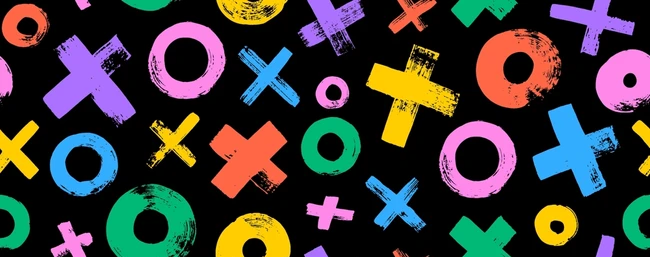

# Tic Tac Toe (Python)

This project is a simple Tic Tac Toe game implemented in Python. Players X and O take turns selecting positions on a 3x3 grid. The game continues until one player wins or the board is completely filled, ending in a draw.

---

## 🚀 Features

* Simple terminal-based board display
* Detects when a player wins
* Detects draw conditions
* Clear turn-based player switching

---

## 📁 Class Structure

### `TicTacToe`

The main game class contains:

* **board**: A list of 10 elements to store board state (positions 1–9 used)
* **player_turn**: Tracks whose turn it is (X or O)
* **show_board()**: Prints the current state of the board
* **swap_player_turn()**: Switches the turn between X and O
* **is_board_filled()**: Checks if the board is full
* **fix_spot()**: Places the player's mark on the chosen cell
* **is_player_win()**: Checks all win conditions
* **start()**: Runs the main game loop

---

## ▶️ How to Run

To start the game, simply run the Python file:

```bash
python tictactoe.py
```

---

## ❗ Important Note

In the original version, the `is_player_win` function had a bug that caused it to check only the first winning combination. The corrected version properly checks all win conditions.

---
## 📄 License 
This project is licensed under the MIT License.
